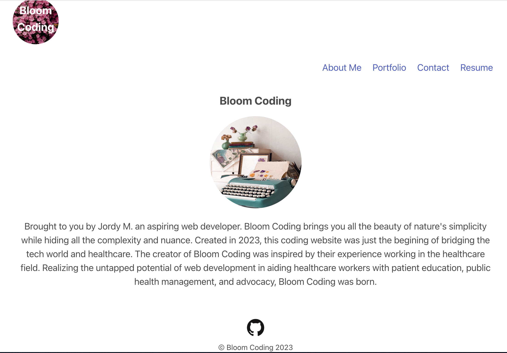

# My-Portfolio
Portfolio created using REACT

## Description
This is a portfolio created using React. The app shows the user's information about themselves in  AboutMe, Contact, Portfolio, and Resume sections. Navigate the app and click through each section to learn more about the user

## Usage
To install this app run `npx create-react-app` to build a src folder. Once React is installed, run `npm run start` to see the app go live. The app was created using bulma css framework and as such also needs to be installed: `npm i bulma`. 

## Link

https://jordymarquez.github.io/My-Portfolio/

## Preview
 

